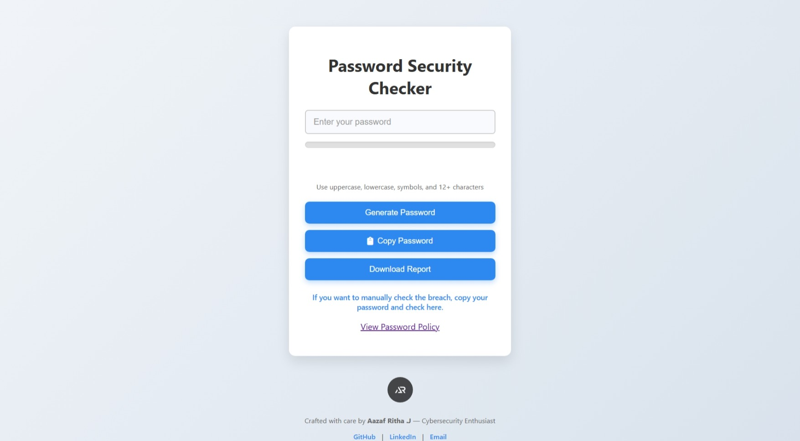

# Password Security Checker

A real-time password strength checker and security awareness tool built with JavaScript and [zxcvbn](https://github.com/dropbox/zxcvbn) to help users create stronger passwords.

## Features
- **Real-time password strength meter** with visual feedback  
- Detailed feedback and suggestions using zxcvbn  
- Password breach check integration via Have I Been Pwned API  
- Secure password tips and policy guidance  
- Downloadable PDF security report  
- User-friendly UI with custom logo and professional design  

## Tech Stack
- HTML5, CSS3, JavaScript (ES6)  
- [zxcvbn](https://github.com/dropbox/zxcvbn) for password strength estimation  
- [jsPDF](https://github.com/parallax/jsPDF) for PDF report generation  
- Hosted on GitHub Pages  

## Screenshot

## Live Demo
Try it out live here: [https://aazafritha.github.io/password-security-checker/](https://aazafritha.github.io/password-security-checker/)

## Author
**Aazaf Ritha** — Cybersecurity Enthusiast  
[LinkedIn Profile](https://www.linkedin.com/in/aazafritha) | [GitHub](https://github.com/AazafRitha)

## License
This project is licensed under the MIT License.
